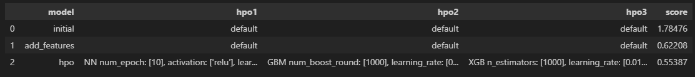
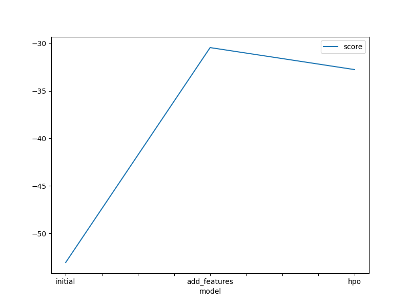
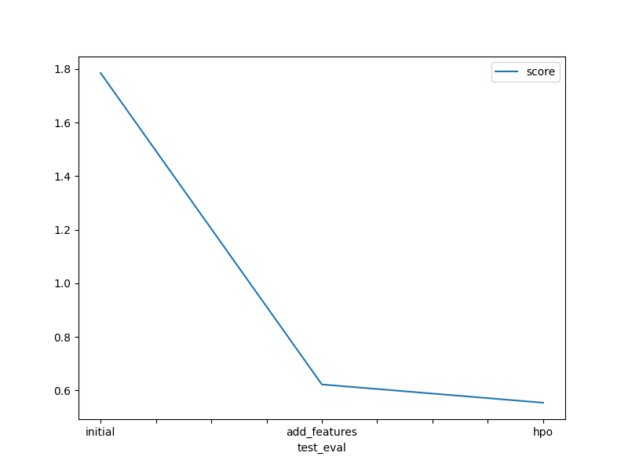

# Report: Predict Bike Sharing Demand with AutoGluon Solution
#### Montserrat Maceda Noda

## Initial Training
### What did you realize when you tried to submit your predictions? What changes were needed to the output of the predictor to submit your results?
Kaggle doesn't allow negative values in the predictions file. In my case there weren't any negative values produced in the files, so I didn't need this time to perfomr any changes.

### What was the top ranked model that performed?
The top ranked model was 'WeightedEnsemble_L3'

## Exploratory data analysis and feature creation
### What did the exploratory analysis find and how did you add additional features?
In the logs from the autogluon first fit execution it shows it detect 9 features and processed them this way:
Feature Metadata (Processed):
(raw dtype, special dtypes):
('float', [])                : 3 | ['temp', 'atemp', 'windspeed']
('int', [])                  : 3 | ['season', 'weather', 'humidity']
('int', ['bool'])            : 2 | ['holiday', 'workingday']
('int', ['datetime_as_int']) : 5 | ['datetime', 'datetime.year', 'datetime.month', 'datetime.day', 'datetime.dayofweek']

It shows here that, though it automatically detected the 'datetime' feature and created new features from that (year, month, day and day of week), is a good idea to create new features in the train dataset from 'datetime' and create new ones for: year, month, day and hour (this last one can be very meaningful for this type of regression problem, because we can easily imagine number of rentals can be affected depending on the hours of the day, and autogluon was not capable of auto generate it). Apart from that, we see the features 'season' and 'weather', which  values in the dataset rage from 1 to 4, are shown as an integer type feature, and they should be categories instead, so I transformed them to category type both.

### How much better did your model preform after adding additional features and why do you think that is?
There was a significant improvement in the "root_mean_squared_error", which is the metric we are using in this problem to score the different models, lowering from -53.060671 for the WeightedEnsemble_L3 model in the first run to  -30.444630 in this run after the feature engineering. As I said before, looking into the histograms, it is evident that one of the features most important for this problem and the one that seems to have a greater influence in the number of rentals is the hour of the day, showing clearly some peaks, and was not present in the training before. This is because, as we can imagine, it is logical that the number of rentals can be increased with the "rush hours" (hours that collides with people going to jobs/schools and retuning home, usually 7-9am, 11am-1pm, and 5-6pm.). Also looking into the histograms it seems that are many more rentals on working days that on holidays, so "rush hours" can be indeed a very important feature.

## Hyper parameter tuning
### How much better did your model preform after trying different hyper parameters?
In this case, in fact initially seems like there's a worsening in the root mean square error, which increase from  -30.444630 to -32.758916 for the best runs. I found that odd, and in fact I experimented with several different configurations for the hyperparameter for the Neural network, XGBoost and Light GBM models, and increasing the time limit for training, and in general I didn't obtain a great difference in performance, the root mean square error ranged approximately from -35 to -32 with the current configuration. However, when submitting the predictions with this model to Kaggle there's an improvement in the score obtained, from 
0.62208 to 0.55387, so my explanation for this is that maybe the previous model was suffering from overfitting, and this last one though initially seems to obtain a worse metric is best suited to perform predictions for this problem. 

### If you were given more time with this dataset, where do you think you would spend more time?
As suggested previously, I think the key to obtain better results here seems to perform a little bit of feature engineering with the "hour" feature, maybe creating a boolean feature to indicate if it is within "rush hours" or not. Another alternative is to investigate and try hyperparameter tuning with another models.

### Create a table with the models you ran, the hyperparameters modified, and the kaggle score.

### Create a line plot showing the top model score for the three (or more) training runs during the project.

### Create a line plot showing the top kaggle score for the three (or more) prediction submissions during the project.

## Summary
The predict bike rental demand problem is a regression type problem in which we are trying to predict the total number of rentals depending on some features related with meteorologic condition's (temperature, humidity, wind, season, weather) and the time (hour, if is a workday/holiday or not). So the first step is always to perform an EDA over the dataset and make some changes over it (feature engineering, cleaning, normalizing etc.) so that's why the first attempt without doing this analysis didn't perform well. After performing the EDA step, we can perform the training with the new dataset obtained (in this case with the TabularPredictor class from Autogluon, which is a good fit for regression problems) and obtained a reasonable solution. In order to obtain a better solution with better predictions, we need to iterate over this result performing some hyperparameter tuning and trying different combinations/parametrization for different models to see if we can obtain a better score. In summary, this problem represents a good example of what a real life problem is, and a basic workflow to work on it.
